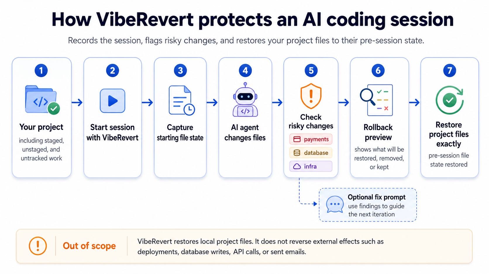

<p align="center">
  
</p>

<h1 align="center">VibeRevert</h1>

<h3 align="center">AI broke your project? Undo the session, not your week.</h3>

<p align="center"><strong>Record · Check · Fix · Restore.</strong></p>

VibeRevert records an AI coding session, flags risky changes, and can restore your project files to exactly how they were before it started, including work you hadn't committed.

**Keep using your coding agent.** VibeRevert adds the safety layer around the session — with Claude Code, Cursor, and other coding-agent workflows.

<p align="center">
  <a href="https://www.npmjs.com/package/viberevert">
    
  </a>
  <a href="https://github.com/madeinplutofabio/vibe-revert/actions/workflows/ci.yml">
    
  </a>
  
  <a href="LICENSE">
    
  </a>
</p>

## See it work

<p align="center">
  
</p>

The actual CLI, condensed from a real beta payment run — `check` flags it, and `rollback` previews what it will change before you `--apply`:

```text
$ viberevert check
risk: CRITICAL · payments
  app/api/checkout/route.ts          payments   (critical)
  app/api/webhooks/stripe/route.ts   payments   (critical)

$ viberevert rollback <session>        # preview — nothing changed yet
  package.json                       tracked_restored
  app/page.tsx                       tracked_restored
  app/api/checkout/route.ts          untracked_deleted
  app/api/webhooks/stripe/route.ts   untracked_deleted
  lib/stripe.ts                      untracked_deleted
  .gitignore  README.md  (your uncommitted work)   skipped_unchanged
```

## Proof, not promises

**3 real AI coding sessions. 3 exact project-file restorations.** Payments, database migrations, and deployment infrastructure — all with pre-existing uncommitted work preserved. [Read the beta report →](docs/beta-report.md)

## Quickstart

Works inside a Git repository and requires Node.js 22+. VibeRevert keeps its records on your machine and requires no VibeRevert account or hosted service.

```bash
npm install -g viberevert@beta
```

```bash
viberevert init                # one-time setup in your project
viberevert run <your-agent>    # records the session and saves your files' starting state
viberevert check               # see what changed and what looks risky
viberevert rollback <session>  # preview putting your files back; add --apply to restore
```

## What it protects you from

You let an AI agent work across your project, and it touched more than you expected — maybe payment code, a database migration, a deploy file — while your own half-finished work was sitting right there uncommitted. VibeRevert captures your project's starting file state first, so a session you don't like doesn't cost you your afternoon.

## What VibeRevert does

Around each AI coding session, VibeRevert:

- **Checkpoints your project first** — working tree, staged changes, and untracked files, including work you haven't committed.
- **Records the session** and the project files that changed while it ran.
- **Flags risky edits** — changes touching auth, payments, databases, secrets, dependencies, or infrastructure ([risk taxonomy](docs/risk-taxonomy.md)).
- **Writes an agent-ready fix prompt** from those findings, to paste into your next iteration.
- **Restores your files** to the checkpoint when you need it.

It **warns** you; it does not silently block your work. An optional pre-commit hook can reject a commit above your configured risk threshold — opt-in, tunable, and bypassable like any local Git hook.

## What rollback restores — and what it doesn't

`viberevert rollback` restores your **local project files** — tracked, staged, and untracked, including uncommitted work — to how they were when the session started. It previews by default; `--apply` writes the change, and every apply first saves an emergency checkpoint.

It does **not** reverse effects outside your project files. Deployments, database writes, third-party API calls, payments, and sent emails need their own recovery. Rollback is state-based rather than atomic, and it's a safety net around AI sessions, not a replacement for tests or review. Read [what rollback can and can't restore](docs/rollback-limitations.md) before you rely on it.

## Works with your coding agent

Keep using the coding tools you prefer. VibeRevert can wrap command-line agent sessions (`viberevert run <your-agent>`) and also integrates with tools such as Cursor and Claude through its installers. It doesn't replace your agent, and it doesn't need to understand it.

## Why not just use your agent's Undo button?

Some coding agents already have checkpoints or a rewind feature. They're useful — use them. VibeRevert solves a *different* problem: **it doesn't belong to the agent.** It wraps the session, captures your project's starting file state including uncommitted work, records what changed, flags risky files, previews the rollback, and restores your project files to that pre-session state. So you can switch agents freely without making any one agent's history your only way back.

| | Built-in agent checkpoints | VibeRevert |
|---|---|---|
| Part of a specific coding agent | Usually | No |
| Restore code changes | Yes | Yes |
| Preserve pre-session uncommitted work | Varies | Yes |
| Flag risky project changes | Varies | Yes |
| Preview planned file restoration | Varies | Yes |
| Keep a local session/check record | Varies | Yes |
| Recovery layer independent of one agent | No | Yes |

> Built-in checkpoints protect you inside one coding agent. VibeRevert protects the project around the agent.

Use one agent today and another tomorrow; the recovery layer stays with your project.

## Wire it into your tools

VibeRevert installs non-destructively and can be removed cleanly. It integrates with Claude Code and Cursor (MCP server and hooks); every install previews its changes and keeps a recovery journal. See [getting started](docs/getting-started.md).

An **experimental** terminal bridge (`--pty`) can intercept commands inside an interactive agent shell; it's best-effort and documented as such in the [PTY contract](docs/pty-contract.md).

## Platforms

Linux, macOS, and Windows, on Node.js 22+. CI runs the suite across all three on Node 22 and 24; see [compatibility](docs/compatibility.md) for exactly what each platform is tested to do.

## Learn more

- [Getting started](docs/getting-started.md) · [Commands](docs/commands.md) · [Configuration](docs/config.md)
- [What rollback can and can't restore](docs/rollback-limitations.md) · [Risk taxonomy](docs/risk-taxonomy.md)
- [Security policy](SECURITY.md) · [Threat model](THREAT_MODEL.md) · [Contributing](CONTRIBUTING.md)

## Support VibeRevert

VibeRevert is Apache-2.0 open source. Sponsoring funds continued cross-platform testing, security work, rollback and recovery testing, and helping pay for independent review. **Sponsorship does not influence risk findings or release decisions.** → **[Sponsor VibeRevert](https://github.com/sponsors/madeinplutofabio?metadata_campaign=viberevert)** · [what your support funds](docs/funding.md)

## License

[Apache-2.0](LICENSE). See [NOTICE](NOTICE) and the [license audit](LICENSE-AUDIT.md).
